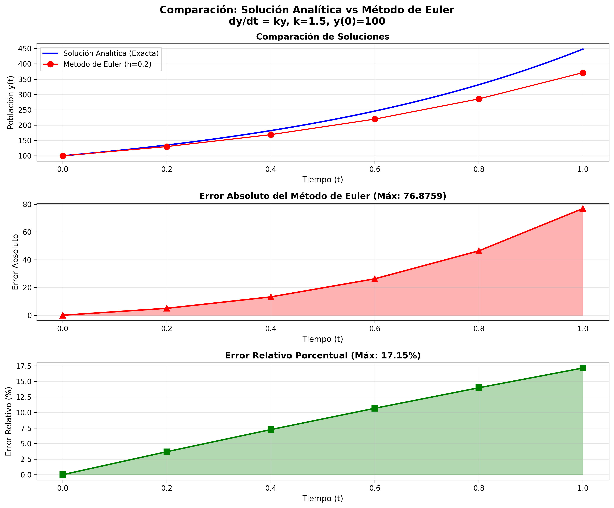
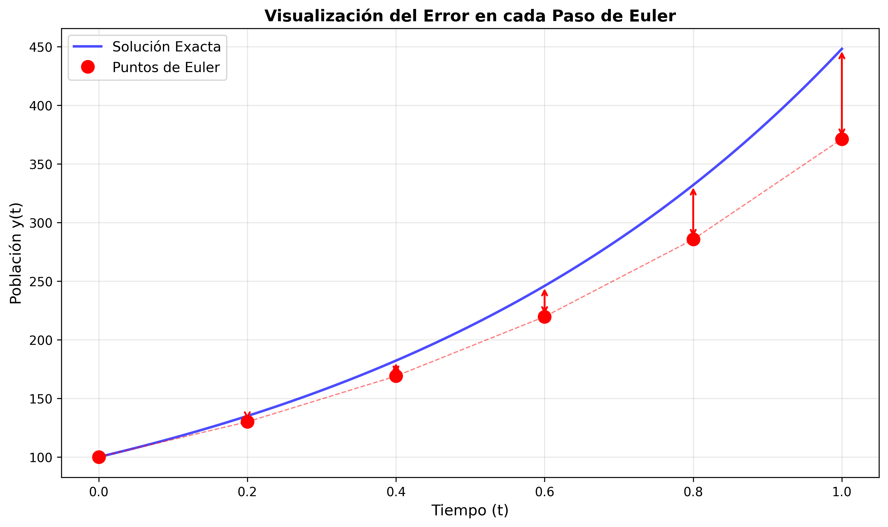

# 📊 Comparación: Solución Analítica vs Método de Euler

[](https://www.python.org/)
[](https://numpy.org/)
[](https://matplotlib.org/)

## 📋 Descripción del Problema

Este proyecto implementa y compara dos enfoques para resolver una **ecuación diferencial ordinaria (EDO) separable**:

1. **Solución Analítica**: Usando el método de separación de variables
2. **Solución Numérica**: Usando el método de Euler

### 🎯 Ecuación Diferencial

**Modelo de Crecimiento Poblacional Exponencial**

```
dy/dt = k·y
```

**Condición inicial:**
```
y(0) = 100
```

**Parámetros:**
- `k = 1.5` (tasa de crecimiento)
- Intervalo: `t ∈ [0, 1]`
- Paso de Euler: `h = 0.2`

---

## 🧮 Parte 1: Solución Analítica (Separación de Variables)

### Proceso de Resolución

**1. Ecuación original:**
```
dy/dt = k·y
```

**2. Separar variables:**
```
dy/y = k·dt
```

**3. Integrar ambos lados:**
```
∫(1/y)dy = ∫k·dt
```

**4. Resolver las integrales:**
```
ln|y| = kt + C
```

**5. Despejar y:**
```
y = e^(kt + C) = e^C · e^(kt) = A · e^(kt)
```
donde `A = e^C`

**6. Aplicar condición inicial y(0) = 100:**
```
100 = A · e^(0)
A = 100
```

### ✅ Solución Exacta

```
y(t) = 100 · e^(1.5t)
```

Esta solución proporciona el valor **exacto** de la población en cualquier tiempo `t`.

---

## 🔢 Parte 2: Solución Numérica (Método de Euler)

### Algoritmo del Método de Euler

El método de Euler aproxima la solución usando la fórmula iterativa:

```
y_{n+1} = y_n + h · f(t_n, y_n)
```

donde:
- `h` = tamaño del paso (0.2)
- `f(t, y)` = función de la EDO (en nuestro caso: `1.5y`)
- `y_n` = valor aproximado en el paso n

### Iteraciones Calculadas

| n | t_n | y_n (Euler) | y(t_n) (Exacta) | Error Absoluto |
|---|-----|-------------|-----------------|----------------|
| 0 | 0.00 | 100.000000 | 100.000000 | 0.000000 |
| 1 | 0.20 | 130.000000 | 134.985881 | 4.985881 |
| 2 | 0.40 | 169.000000 | 182.211880 | 13.211880 |
| 3 | 0.60 | 219.700000 | 245.960311 | 26.260311 |
| 4 | 0.80 | 285.610000 | 332.011692 | 46.401692 |
| 5 | 1.00 | 371.293000 | 448.168907 | 76.875907 |

---

## 📊 Análisis Comparativo

### Estadísticas de Error

| Métrica | Valor |
|---------|-------|
| **Error absoluto máximo** | 76.875907 |
| **Error absoluto promedio** | 27.955945 |
| **Error relativo máximo** | 17.15% |
| **Error relativo promedio** | 8.79% |

### Valores Finales (t = 1)

- **Solución analítica**: 448.168907
- **Método de Euler**: 371.293000
- **Diferencia**: 76.875907

---

## 📈 Visualizaciones

### Gráfica 1: Comparación de Soluciones



Esta gráfica muestra:
- **Curva azul**: Solución analítica exacta
- **Puntos rojos**: Aproximación con método de Euler
- **Gráfica de error absoluto**: Crecimiento del error con el tiempo
- **Gráfica de error relativo**: Error porcentual en cada paso

### Gráfica 2: Visualización del Error



Muestra las flechas que indican la magnitud del error en cada punto calculado por Euler.

---

## 💡 Conclusiones

### 1. **Precisión de Euler**
- El método de Euler proporciona una aproximación **razonable** pero con error acumulativo
- El error crece con el tiempo debido a la naturaleza iterativa del método
- Para este problema, el error relativo final es ~17%

### 2. **Ventajas de cada método**

**Solución Analítica:**
- ✅ Precisión exacta
- ✅ Válida para cualquier valor de t
- ❌ No siempre es posible obtenerla

**Método de Euler:**
- ✅ Aplicable a cualquier EDO
- ✅ Simple de implementar
- ❌ Error acumulativo
- ❌ Requiere balance entre precisión y costo computacional

### 3. **Mejoras Posibles**
- Reducir `h` (por ejemplo, h = 0.1 o h = 0.05) mejoraría la precisión
- Usar métodos más avanzados como **Runge-Kutta** de orden 4
- Implementar paso adaptativo para optimizar eficiencia

---

## 🛠️ Tecnologías Utilizadas

- **Python 3.10+**
- **NumPy**: Cálculos numéricos
- **Matplotlib**: Visualización de resultados
- **Type Hints**: Para código más profesional y mantenible

---

## 🚀 Cómo Ejecutar

### 1. Clonar el repositorio
```bash
git clone https://github.com/TU_USUARIO/comparacion-euler-analitica.git
cd comparacion-euler-analitica
```

### 2. Instalar dependencias
```bash
pip install numpy matplotlib
```

### 3. Ejecutar el script
```bash
python comparacion_euler_analitica.py
```

### 4. Ver resultados
El script generará:
- Tabla comparativa en consola
- Estadísticas de error
- Dos gráficas PNG guardadas en el directorio

---

## 📁 Estructura del Proyecto

```
comparacion-euler-analitica/
│
├── comparacion_euler_analitica.py    # Script principal
├── comparacion_euler_analitica.png   # Gráfica comparativa
├── error_visual_euler.png            # Gráfica de error visual
└── README.md                         # Este archivo
```

---

## 📚 Conceptos Matemáticos Aplicados

### Ecuaciones Diferenciales Separables
Una EDO es **separable** si puede escribirse en la forma:
```
dy/dt = g(t) · h(y)
```

En nuestro caso:
- `g(t) = k` (constante)
- `h(y) = y`

### Método de Euler
Es un **método numérico de primer orden** que aproxima la solución usando:
- La pendiente en el punto actual
- Un paso de tamaño fijo `h`

**Fórmula:**
```
y_{n+1} = y_n + h · f(t_n, y_n)
```

---

## 🎯 Actividad Académica

Este proyecto fue desarrollado como parte de la **Actividad 2** del curso de Ecuaciones Diferenciales.

**Objetivos cumplidos:**
- ✅ Seleccionar una EDO separable
- ✅ Resolver analíticamente con separación de variables
- ✅ Implementar método de Euler (t ∈ [0,1], h = 0.2)
- ✅ Comparar ambas soluciones
- ✅ Visualizar resultados
- ✅ Documentar el proceso

---

## 👤 Autor

**Benjamín Martínez Pérez**

[](https://github.com/BENMP0902)
[](https://linkedin.com/in/tu-perfil)

---

## 📄 Licencia

Este proyecto es de uso académico y está disponible bajo la Licencia MIT.

---

## 📖 Referencias

1. **Boyce, W. E., & DiPrima, R. C.** (2012). *Elementary Differential Equations and Boundary Value Problems*
2. **Chapra, S. C., & Canale, R. P.** (2015). *Numerical Methods for Engineers*
3. [SciPy Documentation - ODE Integration](https://docs.scipy.org/doc/scipy/reference/integrate.html)

---

## 🌟 Mejoras Futuras

- [ ] Implementar método de Runge-Kutta orden 4
- [ ] Agregar comparación con múltiples valores de h
- [ ] Crear interfaz interactiva con Streamlit
- [ ] Exportar resultados a CSV/Excel
- [ ] Agregar más ejemplos de EDOs separables

---

<div align="center">

**⭐ Si este proyecto te fue útil, considera darle una estrella ⭐**

</div>
